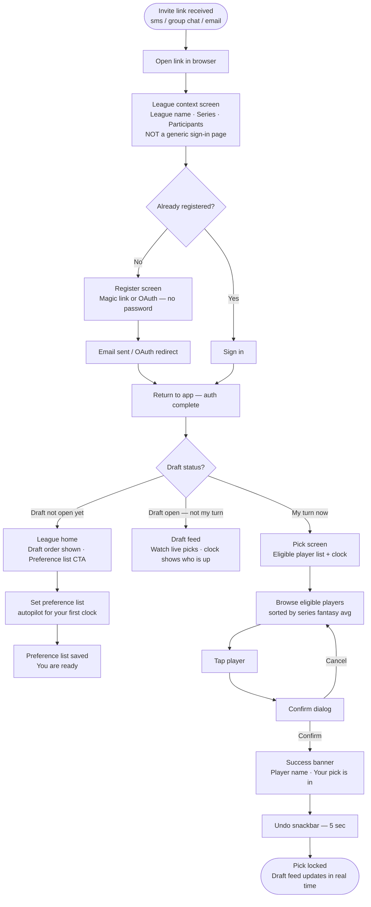
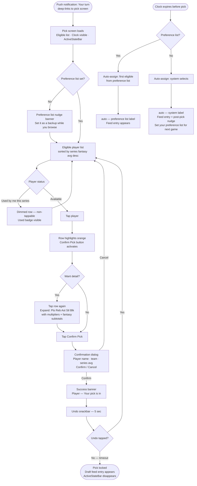
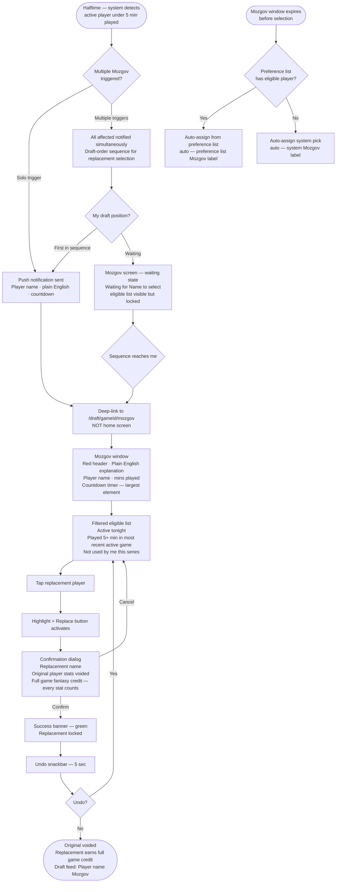
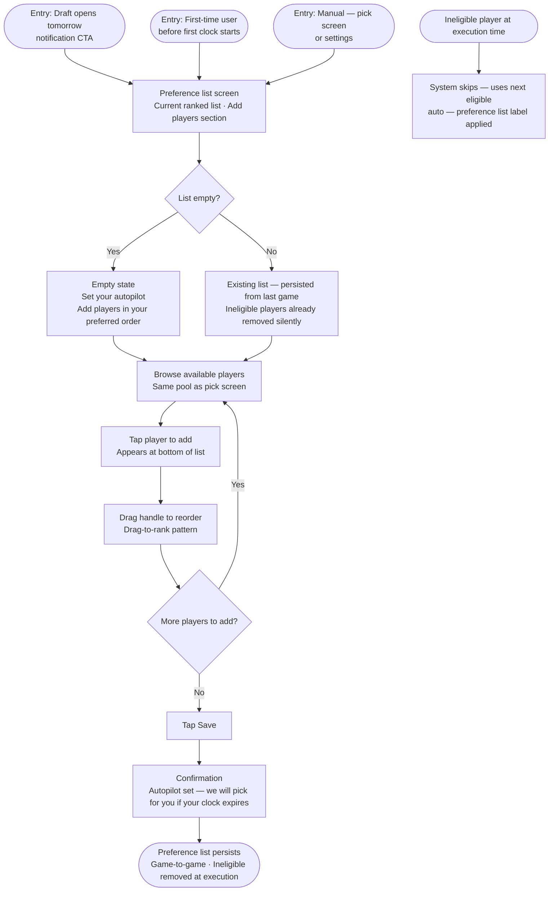
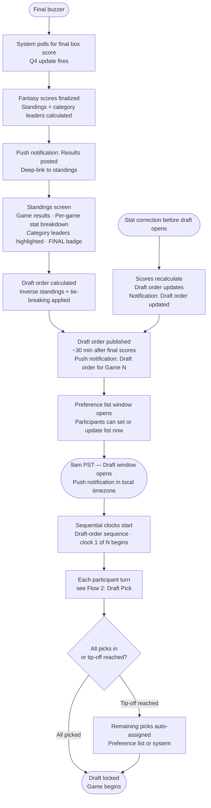
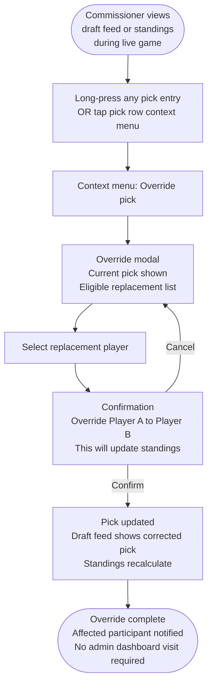
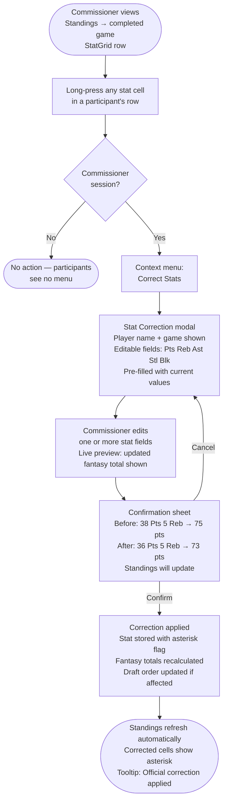

# UX Design Specification fantasy-finals

**Author:** Todd
**Date:** 2026-03-06

---

<!-- UX design content will be appended sequentially through collaborative workflow steps -->

## Executive Summary

### Project Vision

NBA Fantasy Finals is a lightweight, series-based fantasy sports platform for invite-only friend groups. One pick per game. Zero roster management. Automated draft flow with live scoring and the Mozgov Rule — a mid-game halftime replacement mechanic that converts a passive frustration into a time-pressured, high-stakes decision.

UX governing principle: **deliberate minimalism**. Every design decision must reduce coordination cost. Features that add management overhead are explicitly out of scope.

### Target Users

**Todd — The Commissioner Who Just Wants to Watch**
Creates leagues, delegates control, does rare administrative overrides. Uses desktop to set up; mobile to participate like everyone else. Success: no texts from friends asking what to do.

**Jake — The Strategic Player**
Deliberate and prepared. Studies eligible players, uses the preference list as a planned fallback, watches the real-time draft feed closely. Success: uses every feature intentionally.

**Mark — The Casual Player**
Picks by feel. Mobile-only. Needs clear guidance at the right moment — especially during the Mozgov window. If the replacement screen is confusing, he closes the app and tells his friends it's broken. Success: feels in control even when surprised.

**Andrew — The Absent Player**
Sets up the night before, trusts the system to execute. Needs confidence that his preparation will be honored — and needs to know the preference list exists before he needs it. Success: comes back from meetings to find his pick was made correctly.

### Key Design Challenges

1. **Time-pressure UX** — The Mozgov window gives each triggered participant a sequential 3-minute clock (hard deadline: second-half tip-off). Both the per-user clock and the halftime remaining must convey urgency without panic. Clock must escalate visually in the final minute. A persistent "IT'S YOUR TURN" indicator must be visible across all pages when a participant's clock is running.

2. **Draft state legibility on mobile** — "Is it my turn? Who picked? Who's next?" Must be scannable at a glance on a small screen. Push notifications must deep-link directly to the pick UI — landing on any other screen after a "your turn" alert is a failure mode.

3. **Mozgov copy as UX** — The notification and replacement window copy is as load-bearing as the UI itself. "Mozgov Rule triggered" means nothing to a casual player mid-game. Plain-English explanation at the moment of trigger ("Your player played less than 5 minutes. You have 14 min to pick a replacement — they'll earn full game credit.") is what separates a delightful surprise from a confusing bug report.

4. **Auto-assign confidence** — The "auto — preference list" outcome must feel like success, not absence. Post-auto-assign screen must confirm what was picked and why. For "auto — system" outcomes: surface the preference list as the solution for next time.

5. **Preference list discoverability** — This feature is invisible if not proactively surfaced. The "draft opens tomorrow" notification must include a direct CTA to set the preference list. First-time draft participants should be prompted to set their list before their first clock starts.

6. **First-run via invite link** — Invite link landing must lead with league context, not a generic sign-in screen. The gap from "clicked invite" to "made first pick" must be frictionless and contextualized at every step.

7. **Commissioner controls as contextual actions** — Override, delegation, and stat correction must be accessible from the relevant pick or game context — not from a general admin dashboard. No commissioner action should require more than 2 taps from the relevant context during a live game.

### Design Opportunities

1. **Mozgov as the signature moment** — The halftime alert is the product's most novel mechanic. A well-designed replacement window with clear countdown, plain-English explanation, eligible player list, and unambiguous confirmation can make this the most memorable experience in the app.

2. **Draft feed as social glue** — Real-time picks appearing creates a shared "watching together" feeling across a geographically distributed friend group. The feed is the heartbeat of each game.

3. **Preference list as quiet confidence** — Positioning the preference list as "your autopilot" — surfaced proactively before draft windows open — gives casual and busy players genuine peace of mind and makes the app feel like it works for them.

4. **Notification copy as first UX touchpoint** — Every push notification is a UX moment before the app opens. Getting the copy right (specific, plain English, actionable) turns the notification layer into an extension of the app experience, not just an alert system.

## Core User Experience

### Defining Experience

The core loop is a single pick per game. A participant opens the app during their draft turn, scans the eligible player list, taps their choice, confirms, and closes the app. The entire active interaction should take under 60 seconds for a prepared user.

The secondary defining experience is the Mozgov replacement window — a halftime moment that is infrequent but the product's most distinctive mechanic. Each triggered participant gets a sequential 3-minute clock (hard deadline: second-half tip-off). It requires the same one-tap simplicity under time pressure, with explicit confirmation and immediate feedback.

Everything else — standings, draft feed, preference list, notifications — exists to support these two moments or to enable confident absence from them.

### Platform Strategy

- **Primary:** Mobile browser (Safari/iOS, Chrome/Android) — touch-first, thumb-reachable interactions, viewport-aware layouts
- **Secondary:** Desktop browser — same functionality, wider layout, no separate feature set
- **PWA:** Installable on home screen (Chrome/Android, Safari Add to Home Screen); push notification delivery via service worker
- **Offline:** Not required — the app is only meaningful when live data is available; graceful degradation when offline is sufficient
- **Input model:** Touch primary; tap targets minimum 44px; no hover-dependent interactions for core flows

### Effortless Interactions

These must require zero cognitive effort — they should just happen:

- **Pick submission** — tap player, tap confirm, done; two taps maximum from the eligible list to a confirmed pick
- **Draft feed** — opens and updates automatically; nothing to trigger or refresh manually; picks appear as they happen
- **Auto-assign** — fires without any user action required; outcome is visible next time the user opens the app with a clear label explaining what happened
- **Standings** — always current; no "refresh" action needed; post-game corrections apply automatically
- **Preference list persistence** — carries forward game-to-game with ineligible players silently removed; user sets it once, system maintains it

### Critical Success Moments

These are the make-or-break UX moments. Failure here loses the user:

1. **Pick confirmation lands** — after tapping confirm, the user sees an unambiguous success state (player name, points, "your pick is in") before closing the app. If this is ambiguous, users re-pick or panic-text the commissioner.

2. **First pick as a new user** — arriving via invite link, registering, and making a first pick without needing to ask anyone how it works. The funnel from invite link to confirmed pick must be self-explanatory at every step.

3. **Mozgov window opens** — notification arrives with plain-English context, app opens directly to the replacement window (not the home page), countdown is immediately visible, player list is pre-filtered to eligible. User picks, confirms, sees success state. Under 3 taps from notification tap to confirmed replacement.

4. **Auto-assign outcome understood** — returning user sees their pick labeled "auto — preference list" and immediately understands it was intentional and correct. The pick detail shows which preference list position was selected.

5. **Commissioner override in 2 taps** — Todd needs to correct a pick during a live game. He finds the pick, taps override, selects the replacement, confirms. Never leaves the game context to find an admin panel.

### Experience Principles

1. **The app does the work; the user makes the choice.**
   Automation handles everything that can be automated. Users are only asked to make genuine decisions — their pick, their preference order. No administrative overhead leaks into the participant experience.

2. **Every entry into a time-pressured state is unambiguous.**
   When the clock is running, when the Mozgov window is open, when the draft is live — the UI makes this impossible to miss. Urgency is communicated through persistent indicators, not just notifications.

3. **Notifications are action paths, not alerts.**
   Every push notification deep-links to the exact screen needed. A "your turn" notification that lands on the standings page is a broken notification.

4. **First-time users succeed without help.**
   The invite-to-first-pick funnel is self-contained. Context is provided at the moment it's needed, not front-loaded in an onboarding tour.

5. **Confirmation is explicit; ambiguity is failure.**
   Every consequential action (pick, replacement, override, preference save) ends with an unambiguous success state. The user must never wonder if their action registered.

## Desired Emotional Response

### Primary Emotional Goals

**For participants during active play:**
- **Confident** — the system works, my pick is locked, my preference list will execute if I can't be there. Trust in automation is the emotional foundation the whole product rests on.
- **Engaged** — I have a reason to care about this game tonight. My player is out there. I'm watching differently now.
- **Part of something** — my friends are all in on this too. The draft feed shows everyone's picks. We're watching the same game from different couches.

**During the Mozgov moment specifically:**
- **Surprised → focused → relieved** — not panic. The mechanic should feel like a plot twist in a good story: unexpected, time-pressured, but completely manageable with the tools right in front of you.

**For the commissioner (Todd):**
- **Unburdened** — the app ran the draft, chased the stragglers, handled the corrections. Todd watched the game. That's the whole point.

### Emotional Journey Mapping

| Moment | Target Emotion | Risk Emotion to Avoid |
|---|---|---|
| Receive invite link | Curious, intrigued | Confused ("what is this?") |
| Registration flow | Guided, welcomed | Friction, abandonment |
| First pick submitted | Confident, "in the game" | Uncertain ("did that work?") |
| Waiting for turn | Low anticipation | Forgotten, disengaged |
| "Your turn" notification | Alert, focused | Startled, overwhelmed |
| Pick submission | Satisfied, relieved | Doubtful, anxious |
| Mozgov alert fires | Surprised → focused | Panicked, confused |
| Replacement confirmed | Relieved, delighted | Skeptical ("will it count?") |
| Auto-assign outcome | Confident ("system got me") | Betrayed ("wrong player") |
| Checking live score | Invested, excited | Bored, indifferent |
| Game results posted | Triumphant or competitive | Disconnected from outcome |
| Top of leaderboard | Pride, status | Nothing — this must feel good |

### Micro-Emotions

**Must create:**
- **Trust** — the system runs the draft correctly, auto-assign respects my list, stat corrections apply without me doing anything. Every confirmed action and honest label builds this.
- **Urgency without anxiety** — the selection clock and Mozgov window are time-pressured, but the action path is always clear. Ticking countdown + visible player list + obvious confirm button = focused, not panicked.
- **Delight** — the Mozgov moment is the product's signature. If the notification feels human ("Your player sat the first half — you've got 12 minutes to replace them"), the replacement flow is clean, and the confirmation is satisfying, this becomes the story users tell their friends.
- **Belonging** — the draft feed is a shared timeline. Seeing "[Jake] picked Anthony Davis" appear in real time creates the same feeling as watching someone make their pick across the table.

**Must avoid:**
- **Confusion** — especially at the Mozgov window and first-run. A confused user closes the app. A confused user texts the commissioner.
- **Betrayal** — auto-assigned the wrong player, confirmation screen lied, standings didn't update. Trust is built slowly and lost instantly.
- **Overwhelm** — too many options, too much information, too many taps. Minimalism is emotional design, not just aesthetic preference.
- **Invisibility** — the preference list is a feature that builds confidence only if users know it exists. If Andrew doesn't know about it, he feels abandoned by the system when he misses his clock.

### Design Implications

| Target Emotion | UX Design Approach |
|---|---|
| Trust | Every action ends with explicit success state; honest labels ("auto — system" when preference list wasn't set); stat corrections acknowledged in UI |
| Urgency without anxiety | Countdown visible but calm at 60 min; escalates color/weight in final 10 min; player list and confirm always on screen simultaneously |
| Delight (Mozgov) | Notification copy written in plain English; replacement window opens with brief "here's what happened" context; confirmation includes "they'll earn full first-half credit" |
| Belonging | Draft feed styled as a social timeline, not a data table; player picks show participant name prominently; auto-picks labeled distinctively so they read differently in the feed |
| Confidence (auto-assign) | "auto — preference list" success state shows which list position was used; post-game summary highlights automated picks as successes |
| Unburdened (commissioner) | All commissioner actions are contextual, 2 taps max; no admin dashboard to navigate; zero commissioner actions required for normal game flow |

### Emotional Design Principles

1. **Trust is the foundation.** Every design decision either builds or erodes the participant's belief that the system is working for them. When in doubt, confirm explicitly and label honestly.

2. **Urgency is information, not alarm.** Time pressure should create focus, not fear. The interface communicates how much time remains and what to do with it — simultaneously, always.

3. **The Mozgov moment must delight, not confuse.** This is the word-of-mouth mechanic. The notification copy, the window UI, and the confirmation are all part of a single designed experience that should make users want to tell someone about it.

4. **Belonging is felt in the feed.** The draft feed is not a log — it is the social layer. Design it like a moment that people want to watch unfold, not a table they scan for information.

5. **Confidence through absence of doubt.** The user should never have to wonder if something worked, whether their preference list will run, or whether their replacement will count. Ambiguity in any consequential moment is an emotional failure.

## UX Pattern Analysis & Inspiration

### Inspiring Products Analysis

**Spotify** — persistent contextual state, ordered list management, focused dark UI for low-light environments, card-based browsing.

**YouTube** — notification-to-content deep-linking, live content feel with real-time feed updates, thumbnail + name + secondary info card hierarchy.

**Gmail** — undo snackbar after consequential actions, inbox-as-action-queue mental model, visually distinct status labels without visual noise.

### Transferable UX Patterns

**Persistent bottom contextual widget (Spotify Now Playing / YouTube mini-player):**
When a time-sensitive state is active (selection clock running, Mozgov window open), a persistent bottom bar appears on every screen showing the state and countdown. Users never have to navigate to find out "what's happening right now." Disappears automatically when the state resolves.
- Apply to: selection clock indicator, Mozgov window alert

**Drag-to-reorder ordered list (Spotify queue/playlist):**
Users already understand ranked lists they can reorder by dragging. The preference list uses this exact pattern — ranked players in order, drag handle on each row, tap to add/remove. No novel interaction to learn.
- Apply to: preference list management

**Notification → exact content deep-link (YouTube):**
Every push notification lands on the exact screen needed, not the app home. This is already an experience principle; Spotify and YouTube both validate it as table-stakes behavior users expect.
- Apply to: all 5 notification types

**Undo snackbar after consequential action (Gmail):**
After a pick is confirmed, a brief snackbar (5 seconds) offers "Undo" before the pick locks. Reduces confirmation anxiety without adding friction to the pick flow. The confirm dialog handles deliberate intent; the snackbar handles accidental taps.
- Apply to: pick confirmation, preference list save, Mozgov replacement confirmation

**Live content feed (YouTube Live):**
The draft feed should feel like live content being generated, not a table being updated. Picks appear with a subtle animation as they arrive. A "LIVE" or "DRAFT OPEN" indicator at the top signals active state vs. static history.
- Apply to: draft feed, live score display

**Visually distinct status labels (Gmail):**
"auto — preference list" and "auto — system" labels in the draft feed need distinct visual treatments — different background color or border — so they read differently at a glance without being loud. Same principle as Gmail's category chips.
- Apply to: auto-assign labels in draft feed and pick history

### Anti-Patterns to Avoid

- **Spotify's navigation complexity (late versions)** — this product has 4-5 screens total; bottom nav with 3 items maximum (Draft/Game, Standings, League)
- **YouTube's notification volume** — every notification must be genuinely actionable; no "here's what you missed" digests or engagement bait
- **Gmail's feature expansion** — future features must pass the "reduces coordination cost" test per the minimalism constraint
- **Generic loading states** — no full-page spinners; skeleton layouts for all data loads

### Design Inspiration Strategy

**Adopt directly:**
- Persistent bottom contextual widget for active time states
- Notification → exact deep-link (non-negotiable)
- Drag-to-reorder for preference list
- Skeleton loading states (not spinners)

**Adapt for this context:**
- Undo snackbar: 5-second window (picks lock at tip-off, timing matters)
- Live feed feel: subtler than YouTube Live (no chat, no emoji reactions in MVP); feed updates with quiet animation

**Avoid entirely:**
- Tab bars with more than 3 items
- Notification types that don't require immediate action
- Any pattern that adds a new navigation destination for every new feature

## Design System Foundation

### Design System Choice: shadcn/ui (Radix UI + Tailwind CSS)

Already selected in architecture. Rationale: code-owned components (not a dependency), Radix UI accessibility primitives, Tailwind-native, Next.js-idiomatic. No alternatives to evaluate.

### Visual Direction

- **Theme:** Dark (zinc-based backgrounds). Rationale: sports-watching context is low-light; dark reduces eye strain during live game viewing; dark surfaces make orange accent and status colors (green/red) pop for immediate recognition.
- **Accent personality:** Bold, energetic — orange-500. Rationale: high contrast on dark backgrounds; communicates urgency (critical for countdown escalation and Mozgov window); sports-coded without being team-specific; distinctive against the neutral zinc palette.
- **Density:** Moderate. Rationale: balances information density with 44px minimum tap targets on mobile; avoids both the cramped feel of high-density and the excessive scrolling of low-density for a 4-5 screen app.

### Color Token Direction

| Token | Value | Use |
|---|---|---|
| Background | zinc-950 `#09090b` | App background, full-page |
| Card surface | zinc-900 `#18181b` | Cards, panels, bottom sheet |
| Border | zinc-800 `#27272a` | Dividers, card borders |
| Muted text | zinc-400 `#a1a1aa` | Secondary labels, timestamps |
| Body text | zinc-50 `#fafafa` | Primary content |
| Primary accent | orange-500 `#f97316` | CTAs, active states, pick confirm button |
| Accent hover | orange-600 `#ea580c` | Interactive accent hover state |
| Success | green-500 `#22c55e` | Pick confirmed, auto-assign success |
| Destructive / clock escalation | red-500 `#ef4444` | Final 10 min clock, error states |
| Live indicator | orange-500 pulse | LIVE badge, active draft feed |

### Typography

- **Font:** Inter (system-ui fallback) — already used in T3/Next.js baseline
- **Mobile-first scale:** 12px (xs) / 14px (sm) / 16px (base) / 18px (lg) / 24px (xl) / 32px (2xl)
- **Weight usage:** 400 body, 500 labels/secondary actions, 600 player names/pick confirmation, 700 countdown timer, 800+ sparingly for score displays

### Component Strategy

**shadcn/ui components used directly:**
- `Dialog` — pick confirmation modal, Mozgov replacement confirmation
- `Sheet` — preference list panel (bottom sheet on mobile)
- `Sonner` — undo snackbar (5-second window post-pick)
- `Table` — standings view
- `Card` — player selection cards, draft feed items
- `Badge` — auto-assign labels (`auto — preference list`, `auto — system`), status chips
- `Skeleton` — loading states for all data loads (no full-page spinners)
- `Avatar` — participant icons in draft feed

**Custom components required:**
- `ActiveStateBar` — persistent bottom widget (Spotify Now Playing pattern); shows clock countdown or Mozgov window state; appears over bottom nav when active; disappears when state resolves
- `DragList` — drag-to-reorder preference list; uses drag handle per row; touch-compatible (react-beautiful-dnd or dnd-kit)
- `LiveFeedItem` — draft feed entry with entrance animation; shows participant name + player picked + auto-assign label if applicable
- `ScoreBadge` — live fantasy points display with pulse animation while game is active; settles to static on game end

### Customization Strategy

- CSS custom properties defined in `globals.css` for all color tokens (maps to shadcn/ui `--background`, `--card`, `--primary`, etc.)
- Class-based dark mode (`darkMode: 'class'` in Tailwind config); dark class applied at `<html>` — no toggle needed for MVP (dark-only)
- No component library overrides at the component file level; all theming through CSS variables only

## Defining Core Experience

### Defining Experience

fantasy-finals has two signature interactions, one expected and one surprising:

1. **The Pick** — once per game, under a selection clock, tap a player and lock it in. Under 60 seconds for a prepared user.
2. **The Mozgov Moment** — unexpected at halftime, time-pressured, entirely manageable if the UI does its job. This is the word-of-mouth mechanic.

Everything else (standings, draft feed, preference list, notifications) exists to support these two moments or to make confident absence from them possible.

**Defining experience statement:** *"Pick one player per game. Watch them score. If the Mozgov Rule fires at halftime, you've got 3 minutes to replace them."*

### User Mental Model

Users arrive with a sports fan mental model, not a fantasy sports manager mental model:

- They think in terms of *tonight's game*, not roster construction
- They expect the app to tell them what to do and when — not ask them to navigate to the right section
- They compare this to a group text pick'em, not to ESPN Fantasy. The bar is: simpler, faster, more fun than the group chat
- **The Mozgov Rule has no existing mental model** — users have never seen this mechanic. Their first encounter determines whether it feels like a clever twist or a confusing bug. Plain-English notification copy is the mental model injection point.

### Success Criteria for Core Experience

**The Pick:**
- Tap-to-confirmed in ≤2 taps from the pick screen
- Unambiguous success state before user closes the app (player name + "Your pick is in")
- No re-picking, no panic texts to the commissioner

**The Mozgov Replacement:**
- User understands *why* the window opened before they interact with it (notification copy + window header)
- Replacement screen opens directly from notification tap — never lands on home
- Confirmed replacement includes "They'll earn full game credit — every point counts"
- Under 3 taps from notification to confirmed replacement

**Auto-assign:**
- Returning user immediately understands what happened and why ("auto — preference list, position 2")
- Feels like the system succeeded for them, not like the system failed them

### Novel vs. Established Patterns

| Interaction | Pattern Type | Approach |
|---|---|---|
| Player pick (tap + confirm) | Established | Standard selection + confirmation dialog — no novel pattern needed |
| Draft feed (real-time updates) | Established | YouTube Live / sports app feed — users know this |
| Preference list (drag-to-reorder) | Established | Spotify queue — users know drag-to-reorder |
| Selection clock countdown | Established | Sports app timer — escalating color/weight is familiar |
| **Mozgov replacement window** | **Novel** | No existing mental model — requires education at the moment of trigger |
| Auto-assign outcome labeling | Established-adapted | Gmail status chips — adapted for "auto — preference list" / "auto — system" |

**Teaching the Mozgov pattern:**
- The notification copy IS the education: *"Your player sat the first half. You have 14 min to pick a replacement — they earn full game credit, every point counts."*
- The replacement window header echoes this in 1 sentence — no tooltip, no tutorial
- After first experience, the pattern is understood. No onboarding tour needed.

### Experience Mechanics

#### The Pick Flow

```
1. INITIATION
   Trigger: "Your turn" push notification
   → Deep-links directly to /draft/[gameId]/pick
   → Pick screen loads with eligible player list, clock visible

2. INTERACTION
   → User scans eligible list (sorted by relevance/position)
   → Taps player card → card highlights, "Confirm Pick" button activates
   → Taps "Confirm Pick"

3. FEEDBACK
   → Dialog: player name + team + projected pts + "Confirm" / "Cancel"
   → On confirm: green success banner — "[Player Name] — Your pick is in"
   → Sonner snackbar: "Undo" available for 5 seconds

4. COMPLETION
   → Pick locks after 5-second undo window
   → User returns to draft feed or closes app
   → Next time they open: pick appears in feed with their name
```

#### The Mozgov Replacement Flow

```
1. INITIATION
   Trigger: halftime push notification (plain English copy)
   "Your player sat the first half. You have 14 min to replace them."
   → Deep-links directly to /draft/[gameId]/mozgov
   → Replacement window opens showing: countdown, reason, eligible list

2. INTERACTION
   → Window header: brief plain-English explanation (1 sentence)
   → Countdown visible and escalating (orange → red in final 5 min)
   → Eligible list pre-filtered (excludes starters who already played)
   → Tap player → tap "Replace" button

3. FEEDBACK
   → Confirmation: "[Player Name] — Full game credit. Every point counts."
   → Sonner snackbar: "Undo" available for 5 seconds

4. COMPLETION
   → Replacement locks
   → Original pick replaced in feed with "[Player Name] (Mozgov)"
   → Live score updates from replacement player
```

#### The Preference List (Silent Automation)

```
1. SETUP (proactive, not reactive)
   → "Draft opens tomorrow" notification includes CTA to set preference list
   → First-time users prompted to set list before first clock starts

2. EXECUTION (invisible)
   → Clock expires → system selects highest-ranked eligible player
   → No user action required

3. DISCOVERY (post-facto)
   → Next app open: pick labeled "auto — preference list (position 2)"
   → Pick detail shows which position was used
   → Feels like system succeeded, not system acted without permission
```

## Visual Design Foundation

### Color System

Built on shadcn/ui CSS variables mapped to Tailwind zinc + orange palette.

| Semantic Role | Token | Hex | Tailwind |
|---|---|---|---|
| App background | `--background` | `#09090b` | zinc-950 |
| Card / panel surface | `--card` | `#18181b` | zinc-900 |
| Border / divider | `--border` | `#27272a` | zinc-800 |
| Input background | `--input` | `#27272a` | zinc-800 |
| Muted text | `--muted-foreground` | `#a1a1aa` | zinc-400 |
| Body text | `--foreground` | `#fafafa` | zinc-50 |
| Primary CTA | `--primary` | `#f97316` | orange-500 |
| Primary hover | — | `#ea580c` | orange-600 |
| Success / confirmed | — | `#22c55e` | green-500 |
| Destructive / urgent | `--destructive` | `#ef4444` | red-500 |
| Clock — calm | — | `#f97316` | orange-500 |
| Clock — escalated (<10 min) | — | `#ef4444` | red-500 |
| Live pulse | — | `#f97316` animated | orange-500 + CSS pulse |

**Contrast compliance:**
- Body text (zinc-50) on background (zinc-950): ~19:1 — exceeds WCAG AA
- Orange-500 on zinc-950: ~4.7:1 — meets WCAG AA for normal text, AA+ for large text
- Green-500 / red-500 on zinc-950: ~5.1:1 / ~4.6:1 — meets WCAG AA

### Typography System

**Font:** Inter (variable font); `font-sans` in Tailwind via `@next/font/google`.

**Type scale (mobile-first, rem-based):**

| Role | Size | Weight | Tailwind |
|---|---|---|---|
| Score / timer display | 32px / 2rem | 800 | `text-4xl font-extrabold` |
| Section heading | 24px / 1.5rem | 700 | `text-2xl font-bold` |
| Player name (pick card) | 18px / 1.125rem | 600 | `text-lg font-semibold` |
| Body / secondary info | 16px / 1rem | 400 | `text-base` |
| Label / badge text | 14px / 0.875rem | 500 | `text-sm font-medium` |
| Timestamp / muted detail | 12px / 0.75rem | 400 | `text-xs` |

**Desktop adjustment:** scale up one step for headings only (section heading → 28px); body unchanged.

**Line height:** 1.5 for body; 1.2 for display/timer (tighter for numeric emphasis).

### Spacing & Layout Foundation

**Base unit:** 4px (Tailwind default). All spacing uses multiples: 4, 8, 12, 16, 20, 24, 32, 48.

**Layout structure:**
- Mobile: single-column, full-width, bottom nav (3 items max)
- Desktop: centered content column, max-width 640px, same bottom nav or top nav
- Gutters: 16px horizontal padding on mobile (`px-4`); 24px on desktop (`px-6`)
- Card internal padding: 16px (`p-4`)

**Component spacing:**
- Stack spacing between list items: 8px (`space-y-2`)
- Section spacing: 24px (`space-y-6`)
- Bottom nav height: 64px; `pb-16` content padding to prevent overlap with ActiveStateBar
- ActiveStateBar height: 56px; sits above bottom nav when active

**Grid:** Single-column for all MVP views. Standings uses full-width table, not a grid.

**Tap target minimum:** 44px height on all interactive elements; player pick cards min-height 64px.

### Accessibility Considerations

| Concern | Decision |
|---|---|
| Color contrast | All foreground/background pairs ≥ 4.5:1 (WCAG AA) |
| Tap targets | Minimum 44×44px on all interactive elements |
| Focus states | `focus-visible:ring-2 ring-orange-500` via Radix UI primitives |
| Motion | `prefers-reduced-motion` respected; LiveFeedItem animations disabled when set |
| Screen reader | Player cards use `<button>` semantics; countdown uses `aria-live="polite"`, final 2 min `aria-live="assertive"` |
| Color-only status | Clock escalation uses color + weight change; auto-assign labels use color + text |
| Font scaling | Layout tested at 200% browser zoom; no fixed-height containers that clip text |

## Design Direction Decision

### Design Directions Explored

Six pick screen directions (A–F) and two supporting screens evaluated across axes of: list density (compact rows vs. bold cards), decision-support approach (spotlight vs. ranked list vs. filter pills), Mozgov window urgency treatment, post-pick feed design, and standings depth. Informed by the actual 2025 NBA Finals scoring spreadsheet revealing real game data, scoring model, and rule nuances.

### Chosen Direction

**Pick Screen — A/B Hybrid (medium-density rows, ~72px height):**
Direction A rows too narrow for decision-support data; Direction B cards too generous for a 60-second interaction. Chosen direction: taller rows than A with breathing room to display decision data inline, without becoming full cards. No spotlight. No position filters. Always sorted by series fantasy point average descending — the ranked order itself is the primary decision signal.

**Player Row Data Model:**

| Element | Display | Notes |
|---|---|---|
| Player name | Large, semibold | Primary label |
| Team + home/away | Small, muted | "LAL · Home" / "GSW · Away" |
| Series fantasy avg | Right-aligned, bold | Primary sort key |
| Last game fantasy total | Secondary, muted | Context for recent form |
| Used by me badge | Dimmed row + "Used" label | Locked out for this participant this series |

Micro-stats (Pts / Reb / Ast / Stl / Blk with multipliers) shown in **tap-to-expand player detail**, not inline. Jake navigates there; Mark never needs to.

**Player Exclusivity:** Each participant can only use each player once per series. The eligible list is personalized — players already used by *this participant* are dimmed and non-tappable. Other participants can still select the same player.

**Scoring Model (confirmed from 2025 sheet):**
- 1pt per PTS · 2pts per REB · 2pts per AST · 3pts per STL · 3pts per BLK
- Player detail tap-to-expand shows all five stat lines with multipliers and fantasy subtotals

**Mozgov Window — Direction E approved with corrections:**
- Red replaces orange for the full Mozgov window — escalated urgency state
- Countdown timer is the largest element in the header
- Plain-English header names the specific player and situation
- **Active = eligible to play (on game roster, not injured)** — not purely minutes-based
- **Replacement eligibility:** played 5+ mins in most recent game they were active (not necessarily the immediately prior game — accounts for injury absences)
- **Multiple Mozgov triggers:** resolved in draft-order sequence — participant who drafted earliest picks replacement first. Free-for-all (first tap wins) flagged as Phase 2 league setting.
- **Strategic use:** Late-order pickers may deliberately select a borderline-active player expecting Mozgov to trigger, giving them a second pick from top first-half performers. Valid and intentional mechanic — no design guardrail.
- **Confirmation copy:** "[Original Player]'s stats are voided. You'll earn every fantasy point [Replacement] scores tonight — points, rebounds, assists, blocks, and steals."
- **Mozgov replacement eligibility filter:** active tonight AND played 5+ mins in most recent active game AND not already used by this participant this series

**Draft Feed + Success State — Direction F approved:**
Post-pick success banner persists at top of feed. Feed distinguishes pick types: `auto — pref list` and `auto — system` badges visually distinct from manual picks. Draft pick position number shown alongside each feed entry (e.g., "Jake picked Shai · #1 pick" — communicates Jake had lowest score last game).

**Standings — Enhanced with full stat breakdown:**
Points-only display insufficient. Per-game stat grid shows: Pts / Reb / Ast / Stl / Blk / Fantasy Total for each participant's player. Leader in each category per game highlighted (orange, bold). Series total remains the aggregate view. Burned player list visible to all participants within the league.

**Auto-Assign Outcome — approved as-is.**

### Draft Timing Model

| Event | Timing |
|---|---|
| Draft order publishes | ~30 min after game final scores post |
| Preference list window | Immediately after order publishes — available before draft opens |
| Draft window opens | 9am PST following morning |
| Sequential clocks start | 9am PST in draft-order sequence (worst score picks first) |
| Draft window closes | Next game tip-off |
| Draft order notification | Local timezone display; EST users see 12pm, CST 11am |
| Score corrections before draft opens | Auto-recalculate and republish draft order if affected |

**Rationale:** EST participants may be asleep when a late-game final score posts. 9am PST open gives all timezones a morning start for casual work-day drafting. Full inter-game window (2–3 days between NBA Finals games) ensures no clock pressure outside of the sequential 60-minute pick windows.

**Tie-breaking:** If two participants have equal fantasy score in a game, the participant who had the higher draft pick number in that game picks earlier in the next game's draft.

### Score Update Model

| State | Behavior |
|---|---|
| Game in progress | Scores update at end of each quarter (Q1, Q2/halftime, Q3, final) |
| Halftime update | Triggers Mozgov evaluation and window if applicable |
| Final buzzer | Triggers draft order calculation and publish |
| Live indicator | "LIVE · Q2" shown during game; "FINAL" after |
| Stat corrections | Commissioner long-presses a stat cell in any completed game's StatGrid → Correct Stats modal (Flow 7); corrected values stored with asterisk flag; fantasy totals and standings recalculate automatically |

Quarterly updates chosen over real-time polling for MVP: simpler infrastructure, NBA stats APIs have 30–60 sec delay anyway, and quarter-end moments align with natural phone-checking behavior. Real-time (30–60 sec polling) flagged as Phase 2 option.

### Design Rationale

- **Decision support over filtering:** Series avg, last game total, and home/away inline eliminates need for position filters while giving users the same information with less UI.
- **Ranked list as implicit recommendation:** Sorting by series fantasy average puts the best performer first — implicit spotlight without a prescriptive label.
- **Per-person exclusivity visible:** Dimmed "Used" rows give each participant immediate awareness of their remaining player pool without a separate screen.
- **Mozgov full-game credit:** Replacement player earns fantasy points across all stat categories for the entire game. Original player's stats voided. UI must make both sides of this explicit.
- **9am PST draft open:** Respects EST participants' sleep, enables casual work-day drafting cadence, fits the 2–3 day inter-game window of an NBA Finals series.
- **Standings depth:** Category leaders per game create multiple moments of pride or rivalry — turns standings into a post-game conversation, not just a leaderboard.

### Implementation Notes

- Player row: `flex`, `min-h-[72px]`, left: name + team/home-away, right: series avg + last game total
- Used player rows: `opacity-50 pointer-events-none` with "Used" badge
- Mozgov window: `bg-red-500/10 border-red-500/25`; timer `text-4xl font-extrabold text-red-500`; `animate-pulse` in final 3 minutes
- Standings: per-game stat grid; category leader cell: `text-orange-500 font-bold`
- Score state: "LIVE · Q2" indicator using `live-badge` pattern with red pulse dot
- API dependency: player activity/injury status (active roster) needs validation during architecture — flag as implementation risk

## User Journey Flows

### Flow 1: Invite → First Pick (New User Onboarding)

The highest-stakes funnel. Every screen must be contextualized — no generic sign-in walls.



**Failure modes guarded against:**
- Generic sign-in wall after invite tap → replaced by league context screen first
- No preference list prompt for first-timers → surfaced immediately if draft is not open yet
- Invite link expiry → graceful "link expired, contact [Commissioner name]" screen

---

### Flow 2: Draft Pick (Core Loop — Every Game)

The interaction every participant completes once per game. Must be under 60 seconds for a prepared user.



---

### Flow 3: Mozgov Replacement Window

The signature mechanic. Notification copy is load-bearing — it teaches the rule before the app opens.



---

### Flow 4: Preference List Setup

Discovery is the main UX challenge — the list only helps users who know it exists before they need it.



---

### Flow 5: Post-Game → Draft Order → Next Pick (Inter-Game Loop)

The connective tissue between games. Drives next-game engagement and Andrew's set-it-and-forget-it workflow.



---

### Flow 6: Commissioner Override

Must be accessible in 2 taps from any game context. No admin dashboard navigation.



---

### Flow 7: Stat Correction (Commissioner)

Entry point: post-game StatGrid in standings. Commissioner-only; never visible to participants. Must be accessible in 2 taps from the standings context — no admin dashboard navigation.

**Entry point:** Long-press any player stat cell in a completed game's StatGrid row → "Correct Stats" context menu option appears (commissioner session only; participants see no menu on long-press).



**Modal anatomy — Stat Correction:**
```
┌─────────────────────────────────┐
│ Correct Stats                 ✕ │
│ S. Curry · Game 3               │
├─────────────────────────────────┤
│  Pts  [ 38 ]  Reb  [  5 ]      │
│  Ast  [  8 ]  Stl  [  1 ]      │
│  Blk  [  0 ]                    │
├─────────────────────────────────┤
│  Fantasy Total                  │
│  Before: 75 pts → After: — pts │
│  (updates live as fields change) │
├─────────────────────────────────┤
│  [ Cancel ]   [ Apply Correction ]│
└─────────────────────────────────┘
```

**Design rules:**
- Numeric input only; no negative values accepted
- Fantasy total preview recalculates live using the scoring formula as commissioner types
- Confirmation sheet always shown before applying — no one-tap corrections
- Corrected stat cells in StatGrid show `*` superscript; tooltip on tap: "Official NBA stat correction applied"
- Correction is idempotent — reapplying the same values is a no-op

---

### Journey Patterns

**Navigation patterns:**
- All time-sensitive states enter via push notification deep-link — never via home screen navigation
- `ActiveStateBar` persists across all screens when clock is running or Mozgov window is open
- Bottom nav (3 items: Draft/Game · Standings · League) present on all non-modal screens

**Decision patterns:**
- Every consequential action requires exactly one confirmation step (tap → confirm dialog → success)
- Undo snackbar (5 sec) follows every confirmation as a low-friction safety net
- Auto-assign fires silently; outcome is always labeled and explained post-facto

**Feedback patterns:**
- Green success banner: pick confirmed, replacement confirmed, preference list saved
- Red urgency state: Mozgov window header + countdown + confirm button
- Orange clock chip: selection clock running (calm); escalates to red at 10 min remaining
- `auto — preference list` / `auto — system` badges: distinct visual treatment in feed for every automated pick

### Flow Optimization Principles

1. **No orphaned deep-links** — every notification lands on the exact screen needed; landing anywhere else is a broken notification
2. **Used players dimmed, not hidden** — participants maintain awareness of their remaining pool without a separate management screen
3. **Preference list set before clock, not after** — discovery is proactive (draft order notification CTA) not reactive (post-auto-assign regret)
4. **Commissioner actions are contextual** — override is always 2 taps from the relevant pick; admin dashboard is never the path
5. **Mozgov window is self-explanatory on open** — notification copy + window header together constitute the full rule explanation; no tooltip or help link needed at trigger time

## Component Strategy

### Design System Components (shadcn/ui — used directly)

| Component | Usage in fantasy-finals |
|---|---|
| `Dialog` | Pick confirmation modal; Mozgov replacement confirmation; commissioner override modal |
| `Sheet` | Preference list panel (bottom sheet on mobile); player detail expand on desktop |
| `Sonner` | Undo snackbar — 5-second window after every consequential action |
| `Table` | Standings view — per-game stat breakdown, series totals |
| `Card` | League home cards; game summary cards |
| `Badge` | Auto-assign labels; status chips |
| `Skeleton` | Loading states for all data-fetched views — no full-page spinners |
| `Avatar` | Participant initials in draft feed, standings, and league roster |
| `Button` | Confirm Pick; Replace; Save Preference List; Override |
| `DropdownMenu` | Commissioner context menu on pick rows |

### Custom Components

#### PlayerRow

**Purpose:** Core pick screen element. Displays a single eligible player with decision-support data; handles used/available states; supports tap-to-select and tap-to-expand.

**Anatomy:**
```
[ Avatar ] [ Player Name          ] [ Series Avg ]
           [ Team · Home/Away     ] [ Last Game  ]
           ↕ expand: Pts/Reb/Ast/Stl/Blk with ×multipliers + fantasy subtotals
```

**States:**

| State | Visual |
|---|---|
| Default | zinc-900 background, zinc-800 border |
| Hover | `bg-orange-500/5` |
| Selected | `border-l-2 border-orange-500`, orange tint |
| Used (this series) | `opacity-50 cursor-not-allowed` + "Used" badge |
| Expanded | Full stat breakdown with multipliers and fantasy subtotals |

**Variants:** Standard (pick screen); Compact (preference list); Disabled (Mozgov waiting state)

**Accessibility:** `role="button"`; `aria-pressed` selected; `aria-disabled` used; `aria-expanded` detail panel; stat breakdown uses `<dl>`

---

#### ActiveStateBar

**Purpose:** Persistent bottom widget visible across all screens when a time-sensitive state is active. Disappears automatically when state resolves.

**Anatomy:**
```
[ State label    ][ Sub-label        ][ Clock chip ]
  YOUR TURN        47 min remaining    ● 47:22
```

**States:**

| State | Trigger | Visual |
|---|---|---|
| Clock — calm | > 10 min remaining | Orange tint, orange text |
| Clock — urgent | ≤ 10 min remaining | Red tint, red text, subtle pulse |
| Mozgov — waiting | Triggered, not my turn | Red, "Waiting for [Name]" |
| Mozgov — active | Triggered, my turn | Red, animated countdown, "Replace Now" CTA |
| Hidden | No active state | `display: none` |

**Behavior:** 56px height; sits above bottom nav; `pb-14` on main content; tapping deep-links to relevant screen; auto-dismisses on pick confirmed or clock expiry.

**Accessibility:** `role="status"` with `aria-live="polite"`; escalates to `aria-live="assertive"` at 2 min remaining

---

#### DragList

**Purpose:** Ranked drag-to-reorder list for preference list management. Touch-compatible.

**Anatomy:**
```
[ ≡ handle ] [ Avatar ] [ Player Name · Team ] [ × remove ]
```

**States:** Default; Dragging (elevated shadow); Drop target (orange insertion line); Empty (autopilot empty state)

**Implementation:** dnd-kit (`useSortable` + `DndContext`); keyboard reorder via arrow keys

**Accessibility:** `aria-grabbed`; announces position changes to screen readers

---

#### LiveFeedItem

**Purpose:** Single draft feed entry with entrance animation. Communicates participant, player, pick type, and draft position.

**Variants:**

| Type | Badge | Color |
|---|---|---|
| Manual pick | Pick | orange |
| Auto — preference list | auto — pref list | zinc muted |
| Auto — system | auto — system | zinc muted |
| Mozgov replacement | Mozgov | red |

**Entrance animation:** Slide + fade in 200ms; disabled when `prefers-reduced-motion` set

**Accessibility:** Feed container `role="log"` with `aria-live="polite"`

---

#### ScoreBadge

**Purpose:** Participant's current fantasy point total for the active game. Pulses while live; static at final.

**States:** Live (orange pulse); Quarter update (brief flash); Final (white static, FINAL label); Hidden (no active game)

**Variants:** Large (standings header, 32px extrabold); Inline (feed item, 14px semibold)

**Accessibility:** `aria-label="38 fantasy points, game in progress quarter 3"`; pulse paused when `prefers-reduced-motion` set

---

#### StatGrid

**Purpose:** Per-game stat breakdown in standings. Shows Pts / Reb / Ast / Stl / Blk / Fantasy Total per participant's player. Category leader highlighted.

**Anatomy:**
```
Name    Player     Pts  Reb  Ast  Stl  Blk  Total
Jake    S. Curry   38   5    8    1    0    75  <- leader cells: text-orange-500 font-bold
```

**States:** Live (LIVE · Q[n] badge, quarterly updates); Final (FINAL badge); Corrected (asterisk `*` superscript on affected cells + tooltip on tap: "Official NBA stat correction applied")

**Commissioner interaction:** Long-press any stat cell in a completed game row → "Correct Stats" context menu (commissioner session only) → Flow 7

**Variants:** Game view (single game); Series total (aggregate)

**Accessibility:** `<table>` with `<thead>` and `<th scope="col">`; leader cells include `aria-label="Category leader"`

---

### Component Implementation Strategy

- Custom components in `src/components/fantasy/`; shadcn/ui in `src/components/ui/`
- All styling via Tailwind utility classes + CSS custom properties in `globals.css` — no per-component style overrides
- Semantic token classes only (`text-primary`, `bg-destructive`) — no raw color strings in component code
- Single named export per component; no default exports

### Implementation Roadmap

**Phase 1 — Core pick loop (build first):**
1. `PlayerRow` — pick screen requires it
2. `ActiveStateBar` — clock visibility is a design principle
3. `LiveFeedItem` — primary post-pick feedback
4. `ClockChip` Badge variant — used in ActiveStateBar and pick screen header

**Phase 2 — Mozgov and preference list:**
5. `DragList` — preference list management
6. `ScoreBadge` — live scores in standings and feed
7. `AutoBadge` Badge variant — auto-assign labels

**Phase 3 — Standings depth:**
8. `StatGrid` — per-game category breakdown with leaders
9. `MozgovWindow` page composition (PlayerRow + ActiveStateBar + red header — page layout, not a component)

## UX Consistency Patterns

### Button Hierarchy

| Level | Use | Style | Example |
|---|---|---|---|
| Primary | Single consequential action per screen | `bg-orange-500 text-white rounded-xl py-3 font-bold w-full` | Confirm Pick, Replace, Save List |
| Destructive | Irreversible or urgent action | `bg-red-500 text-white` (Mozgov window only) | Replace (Mozgov confirm) |
| Secondary | Cancel / non-destructive alternative | `border border-zinc-700 text-zinc-300 bg-transparent` | Cancel, Clear selection |
| Ghost | Low-emphasis navigation action | `text-orange-500 font-semibold` | "Update list →" nudge links |
| Icon | Commissioner contextual action | 44px tap target, `text-zinc-400 hover:text-zinc-50` | Override context menu trigger |

**Rules:**
- One primary button per screen; never two orange buttons competing
- Primary button always full-width on mobile; max-width 400px on desktop
- Destructive red used exclusively for Mozgov window
- All buttons minimum 44px height; disabled state uses `opacity-50 cursor-not-allowed`

---

### Feedback Patterns

**Success:**
- Full-width green banner: `bg-green-500/12 border border-green-500/30 rounded-xl`
- Green dot + bold label + secondary sub-label
- Persists until user navigates away — not auto-dismissed
- Always followed by Sonner undo snackbar (5 sec)
- Examples: "Anthony Davis — Your pick is in", "Replacement locked", "Autopilot set"

**Error:**
- Inline below the triggering action — `text-red-400 text-sm`
- Never a blocking modal for recoverable errors
- Example: "That player is no longer eligible — choose another"

**Urgency:**
- ActiveStateBar handles all urgency signaling — no additional urgency toasts
- Clock escalation: orange → red at 10 min remaining (color change, no copy change)
- Mozgov window: entire screen shifts to red theme — header, countdown, confirm button

**Info / nudge:**
- Inline card: `bg-zinc-800/60 border border-zinc-700 rounded-xl text-sm text-zinc-400`
- Always includes an actionable link
- Used for: preference list nudge on pick screen, post-auto-assign "set your list" prompt

**Loading:**
- Skeleton screens for all data loads — no spinners, no blank states
- Skeleton matches the layout of the content it replaces
- If data takes >3s, show "Still loading…" text below skeleton

---

### Form Patterns

- **Save is explicit** — drag-to-reorder does not auto-save; user taps "Save" to commit
- **Optimistic update** — "Saving…" then "Saved" inline; no full-page reload
- **Validation is silent** — no error for an empty list; no minimum required
- **Persistence confirmation** — after save: "Autopilot set — we'll pick for you if your clock expires"
- **No text inputs in MVP** — player browsing uses tap, not search

---

### Navigation Patterns

**Bottom nav (persistent, 3 tabs max):**

| Tab | Active state |
|---|---|
| Draft / Game | `text-orange-500` |
| Standings | `text-orange-500` |
| League | `text-orange-500` |

- Active tab: orange icon + label; inactive: zinc-400
- Adding a 4th tab requires removing one — non-negotiable

**Deep-link navigation:**
- Every push notification resolves to a specific screen — never the home tab
- If auth required: auth → redirect to target (not home)
- Back navigation: modal screens use Cancel; full-screen flows use top-left chevron back to draft feed
- No nested navigation deeper than 2 levels

**ActiveStateBar as navigation:**
- Tapping the bar navigates to the action screen (clock → pick screen; Mozgov → Mozgov window)

---

### Modal and Overlay Patterns

**Confirmation dialog (Dialog):**
- Triggered by: Confirm Pick, Mozgov Replace, Commissioner Override
- Contains: action summary + confirm button + cancel
- Never contains form fields
- Dismissible via Cancel or backdrop tap (cancel, not confirm)

**Bottom sheet (Sheet):**
- Used for: preference list on mobile, player detail on desktop
- Handle bar at top for drag-to-dismiss
- Not used for confirmation

**Context menu (DropdownMenu):**
- Long-press on pick row (commissioner only)
- "Override pick" in MVP — navigates to Override modal, not inline execute

---

### Empty States

| Screen | Condition | Message | CTA |
|---|---|---|---|
| Draft feed | Draft open, no picks yet | "Draft is open — you pick [Nth]" | "Pick now" if their turn |
| Draft feed | Draft not open | "Draft opens [date] at 9am PST" | "Set your preference list" |
| Preference list | No players added | "Set your autopilot — add players in your preferred order" | Scroll to player browser |
| Standings | Series not started | "Standings will appear after Game 1" | None |

**Rules:** Empty states always include a CTA unless no action is possible; never a raw empty list.

---

### Notification Copy Standards

| Notification | Copy pattern |
|---|---|
| Draft order published | "Draft order for Game [N] is set — you pick [Nth]" |
| Draft window open | "Draft is open — pick your player for Game [N]" |
| Your turn | "[Name], it's your turn — [N] min on the clock" |
| Pick reminder | "[N] min left on your clock — pick before it expires" |
| Mozgov triggered | "[Player] played [N] min in the first half. You have [M] min to pick a replacement — they earn full game fantasy credit." |
| Results posted | "Game [N] final — [Winner] leads with [X] pts. Standings updated." |

**Rules:**
- No notification without a specific action or outcome
- Mozgov notification always names the player and minutes played — never "Mozgov Rule triggered"
- All notifications deep-link to the exact relevant screen

## Responsive Design & Accessibility

### Responsive Strategy

**Primary (mobile browser — 375px–430px):**
Single-column, thumb-reachable, full-viewport-width. Core flows fully functional without horizontal scrolling. Bottom nav and ActiveStateBar fixed to viewport bottom. All interactive elements minimum 44px height.

**Tablet (768px+):**
No separate tablet layout. Mobile layout centered at max-width 640px with symmetric margin. Same components, no multi-column.

**Desktop (1024px+):**
Same functionality, same screen structure. Content column fixed at max-width 640px, centered. Bottom nav stays bottom-fixed. StatGrid benefits from extra horizontal space. No desktop-exclusive features.

**Key principle:** Desktop is a generous mobile layout. No feature is desktop-only or mobile-only.

### Breakpoint Strategy

Using Tailwind default breakpoints, mobile-first:

| Breakpoint | Min-width | Usage |
|---|---|---|
| Base (mobile) | 0px | All default styles; single-column; full-width |
| `sm` | 640px | Content column max-width cap; padding increases |
| `md` | 768px | StatGrid columns expand; card padding increases |
| `lg` | 1024px | No layout changes — column already capped |

**Applied rules:**
- `max-w-xl mx-auto` on main content wrapper
- `px-4 sm:px-6` — 16px mobile, 24px desktop gutter
- `min-h-[72px]` on PlayerRow — consistent across all viewports
- Bottom nav: `h-16` fixed on all viewports
- ActiveStateBar: `h-14` fixed above bottom nav when active
- Bottom nav never converts to sidebar — 3 tabs, all viewports

### Accessibility Strategy

**Target level:** WCAG AA

**Contrast ratios:**

| Pair | Ratio | Standard |
|---|---|---|
| zinc-50 on zinc-950 (body text) | ~19:1 | Exceeds AA |
| orange-500 on zinc-950 (accent) | ~4.7:1 | Meets AA |
| green-500 on zinc-950 (success) | ~5.1:1 | Meets AA |
| red-500 on zinc-950 (urgent) | ~4.6:1 | Meets AA |
| zinc-400 on zinc-950 (muted) | ~4.6:1 | Meets AA |

**Keyboard navigation:**
- All core flows fully keyboard-navigable; no keyboard traps
- Pick screen: Tab through rows; Space/Enter to select; Tab to Confirm; Enter to confirm
- Preference list: Tab to drag handles; arrow keys to reorder; Delete to remove
- Modals: focus trapped inside; Escape to cancel

**Screen reader support:**
- Semantic HTML: `<nav>`, `<main>`, `<section>`, `<button>`, `<table>`
- All icon buttons have `aria-label`
- Draft feed: `role="log"` + `aria-live="polite"`
- Clock countdown: `aria-live="polite"` > 10 min; `aria-live="assertive"` ≤ 2 min
- Success/error banners: `role="status"` + `aria-live="polite"`
- Skeleton screens: `aria-busy="true"` on loading container

**Motion:** All animations check `prefers-reduced-motion`; replaced with instant state changes when set

**Color independence:** All status changes use color + secondary signal (weight, text label, or opacity) — never color alone

**Focus indicators:** `focus-visible:ring-2 ring-orange-500 ring-offset-2 ring-offset-zinc-950` on all interactive elements; never suppress without replacement

### Testing Strategy

**Responsive:**
- Physical device: iPhone SE (375px), iPhone 15 Pro (393px), Android Chrome
- Desktop: Chrome and Safari at 1280px and 1440px
- PWA install flow: iOS Add to Home Screen + Android Chrome install

**Accessibility:**

| Test | Tool |
|---|---|
| Automated scan | axe-core via `@axe-core/react` |
| Screen reader — iOS | VoiceOver on iPhone (primary) |
| Screen reader — macOS | VoiceOver on Safari |
| Keyboard-only | Manual tab-through of all 6 journey flows |
| Color contrast | DevTools contrast checker |
| Reduced motion | macOS Accessibility → Reduce Motion |

**Minimum bar before ship:** Zero axe-core critical/serious violations; all 6 flows completable keyboard-only; VoiceOver on iOS can complete pick flow and read draft feed

### Implementation Guidelines

**Responsive:**
- Mobile-first Tailwind: base styles for mobile; `sm:` / `md:` only when layout expands
- `rem` for typography; `px` for borders/rings; avoid fixed heights on content containers
- `dvh` not `vh` for mobile viewport height to avoid toolbar overlap
- `max-w-xl mx-auto w-full` wrapper on every page's main content

**Accessibility:**
- Radix UI primitives handle focus trapping, keyboard nav, and ARIA for Dialog, Sheet, DropdownMenu — do not re-implement
- `LiveFeedItem` list: `<ul role="log">`; each item `<li>` — not a `<div>` stack
- `StatGrid`: genuine `<table>` with `<caption>` (visually hidden), `<th scope="col">`, `<th scope="row">`
- Never disable focus outlines globally — suppress `focus` not `focus-visible`
- All interactive states (hover, active, disabled) must be distinct for keyboard users
